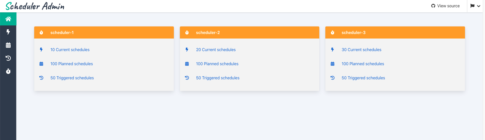
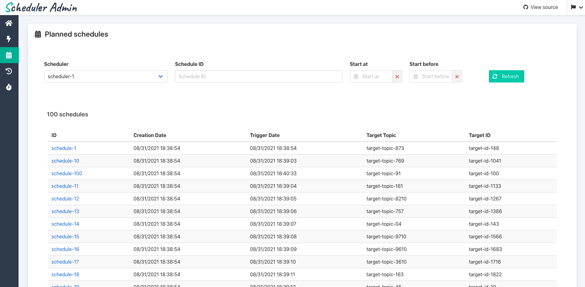
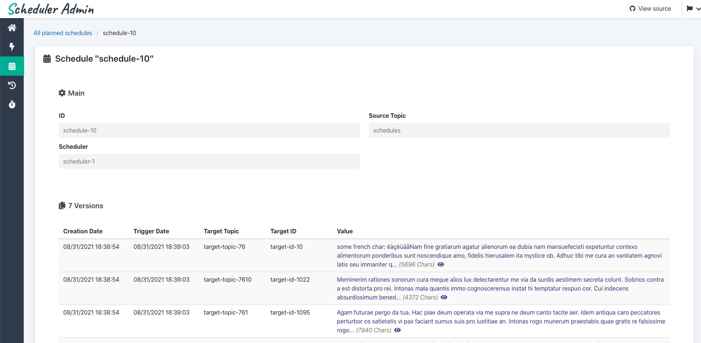

**scheduler admin** is a admin GUI for administration of [kafka message scheduler](https://github.com/etf1/kafka-message-scheduler)


### User Interface

Scheduler admin exposes an user interface. You can access it in your web browser on http://localhost:9000/.





## Getting started

To run the scheduler admin you can use docker, it will need a scheduler to connect to, you can specify in the variable env. `SCHEDULERS_ADDR` for example: `SCHEDULERS_ADDR=scheduler`.

### Production ready version

```
docker run -d --restart=always -e SCHEDULERS_ADDR=<schedulers-address> \
   -p 9000:9000 -p 9001:9001 --name scheduler-admin \
   etf1/kafka-message-scheduler-admin
```

### Mini version

The mini version is a "mocked" version of the admin all in one, for demonstration purpose

```
docker run -d --restart=always -e -p 9000:9000 -p 9001:9001 \
   --name scheduler-admin-mini etf1/kafka-message-scheduler-admin:mini
```
Then open browser to `localhost:9000`

## Usage

The server exposes two ports:

- `9000` is the server port. 
- `9001` is the port for exposing prometheus metrics.

- `/` will expose the user interface
- `/api` will expose the api endpoints

## API Routes

GET methods

URL Parameters:
- `{name}`: scheduler name
- `{id}`: schedule ID

### config
- `/stats` : expose some statistics
- `/schedulers` : list of registered schedulers

### all schedules
- `/scheduler/{name}/schedules`: search for schedules 
- `/scheduler/{name}/schedule/{id}`: get schedule detail

### live schedules
- `/live/scheduler/{name}/schedules`: search for schedules
- `/scheduler/{name}/schedule/{id}`: get schedule detail

### history schedules
- `/history/scheduler/{name}/schedules`: search for schedules
- `/history/scheduler/{name}/schedule/{id}`: get schedule detail

### search parameters

- `schedule-id`: part of the schedule ID
- `epoch-from`: lower range of schedule epoch
- `epoch-to`: upper range of schedule epoch
- `max`: max number of result returned (cannot be more than 1000)
- `sort-by`: sort field, format is `field order`. 
   - Available options for field are: `timestamp`, `id`, `epoch`
   - Available options for order are: `asc`, `desc`
   - Default is `timestamp desc`

## Development

### Backend (in folder /server)

#### Prerequisities

For development you will need external dependencies such as kafka, in order to start this dependencies you can run :

- `make up`: startup development environment with external dependencies (kafka, scheduler, ...)
- `make down`:  shutdown development environment

The backend is written in Go. You can use the following commands to manage the development lifecycle:

- `make start`: start GO server
- `make build`: compile the code
- `make bin`: generate a binary
- `make lint`: run static analysis on the code
- `make test`: execute unit tests
- `make test.integration`: execute integration tests
- `make tests`: execute all tests
- `make tests.docker`: execute all tests in "black box" inside docker containers

To start the server `make start`

### Frontend (in folder /client)

#### Prerequisities

For development you will need a running admin server launched as described before or the mini version of the scheduler admin which is running without any external dependencies:

- `docker run -p 9000:9000 etf1/kafka-message-scheduler-admin:mini`: startup mini version of the scheduler (no external dependencies required)

or start a standard admin server

- `make start` (inside /server): startup GO server on local

The frontend is written with TypeScript and React. You can use the following commands to manage the development lifecycle:

- `yarn`: install the dependencies
- `yarn start`: start the frontend in development mode, with live reload
- `yarn build`: generate the transpiled and minified files and assets
- `yarn test`: execute unit tests

To start the server `yarn && yarn start`

Then open brower at the classic address: http://localhost:3000

## Contributors

- [Emmanuel FERTER](https://github.com/eferte)
- [Fatih KARAKAS](https://github.com/fkarakas)
